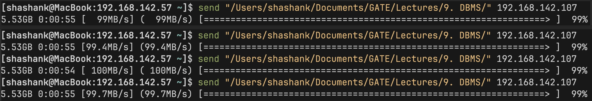

# Local-Transfer
- The simplest way to transfer files over a local network.
- Simple as in "software", not as in "user experience"
- This is the lowest high-level (or highest low-level) way to achieve this.

## Installation
- pv is the only dependency
- Make sure to install the latest version (pv 1.9.31)
- macOS's Homebrew and Termux's pkg both provide this latest version but if you're on Debian/Ubuntu/Linux Mint, you will get an older version, in which case you need to build from the source
- [OR] you can omit the --si flag from pv in send.sh
- The script works even without pv, you can just omit related code but you won't get a progress bar though.

## Usage

### Receiver
```bash
bash get.sh "/path/to/folder"
```
```bash
bash get.sh "~/storage/shared/Download/"
```

### Sender
```bash
bash send.sh "/path/to/file[OR]folder/" <IP_ADDRESS>
```
```bash
bash send.sh "~/Documents/file.pdf" 192.168.29.14
```

### Tips
- To share files to and from your smartphone, install and set up Termux with these scripts.
- Use your smartphone hotspot while running the script as routers are usually slow.
- You can add these scripts as your alias in bashrc/zshrc and just write get and send.
- Note: If you consistently get very low speeds that doesn't mean the scripts are bad, it means you need to upgrade your hardware.

# Benchmarks
- We can get >103 MBps under "ideal" conditions with these scripts on a gigabit network.
- This is >95% of iPerf3 speeds (106-108 MBps) on the same device under the same conditions.
- This is >90% of modern ethernet speeds (110-115 MBps).
- This is >82% of the theoretical maximum speeds (125 MBps) of the gigabit network itself.
- The 5% overhead compared to iPerf3 is the unavoidable overhead from TCP and other tools, such as tar, pv, and bash.

# Proofs

- We sometimes also achieve <54 seconds too (but rare).
- If we transferred 5.53GB in 0:00:54 then our speed is rough ~105 MBps, this is ~97% of max iPerf speeds, ~91% of practical ethernet speeds, and ~84% of theoretical gigabit network speeds!
- The code is very lean; 44 lines of shell code.

# Testing
- I tested this on my [2022 MacBook Air](https://support.apple.com/en-in/111867) as the sender and my 4-year-old [Realme GT Master Edition](https://www.gsmarena.com/realme_gt_master-11001.php) Android phone as the receiver (using Termux).
- My hardware is relatively old and doesn't represent the cutting edge. Better hardware (for modern NIC) and modern standards (for Wi-Fi 7 or better) will yield even better results.

# Tradeoffs
- Many features have been intentionally removed to reduce the overhead of the file transfer as much as possible.
- The code itself is very optimized and lean.
- Time and space complexity is unavoidably O(n)
- Removed/Avoided features:

1. Authentication & Authorization
2. Encryption
3. Pause/Resume
4. Partial file handling
5. Temp file creation
6. Compression
7. Checksum verification
8. Extensive error handling
9. Config files
10. Logging

And many many more.

- Only use this if you are ready to accept these tradeoffs.

# Micro-optimizations
- The goal is not just to build a highly optimized solution, it's to build the simplest possible highly optimized solution.
- What is the simplest solution one can create that can maximize speed/performance/throughput/latency as much as possible? This is what we're aiming for.
- We can always add a niche platform-specific CPU optimization that's going to save us 0.0000002 ms in latency but drastically reduce the readability, maintainability, and simplicity of our scripts.
- For context, if we transfer a 100 GB file (a file so big that most people won't transfer usually), then it would take 
16.57 minutes with 103 MBps (our script) compared to 13.65 minutes with 125 MBps (theoretical limit).
- This means we'll roughly save around ~3 minutes at max on a very massive file occasionally at best. Note that this much savings can never be achieved, because 125 MBps is impossible practically. It is the max that we can achieve, that's all (Not worth it IMHO).
- However, if you still want to do all of these micro-optimizations though, there's a Program.c file in the repo.
- Compile it with
```bash
clang Program.c
```
- And run
```
./a.out s /path/to/file
```
```
./a.out 192.168.29.194 /filename/to/saveas
```
- The extreme optimization approach results in unreliable transfers most of the time. Also, there's no progress bar or timeout, so watch out :)
- It works when it works, but when it does, it results in extremely fast speeds.

# Workflow

